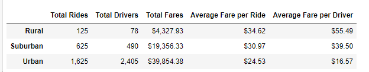

# PyBerAnalysis
## Overview of the Analysis
The goal of this challenge was to analyze PyBer ride sharing data to find the relationship between rides, fare amounts and the location of the rides. The analysis should use Pandas and Python to create a summary Data Frame of the ride-sharing data by city type and a multiple-line graph that shows the total weekly fares for each city type. 
## Results
### Data Frame
The below image is the final Data Frame that was created to illustrate the riding-sharing data. 

#### Multiple Line Graphs
The below image is the final Multiple Line Graph that was created to show the total weekly fares for each city type. 

## Summary 
## Results by City Type
Urban 
  - Urban cities have the most drivers, the largest number of total rides and overall have the most money in total fares. In general, the demand for rides remains consistent. 

Suburban
  - Suburban cities come in second for number of total tides, total drivers and total fares. In general, the demand for rides remains consistent.

Rural
   - Rural cities have the lowest demand for rides; however, they have the highest average fare per ride and the highest average fare per driver. In general, the demand for rides remains consistent.

## Business Recommendations 
These differences in city types can be used by decisions makers at PyBer.  In general, there appears to be an opportunity to expand in the rural and suburban areas. Currently urban cities have more drivers than number of rides. Recommend efforts be more focused in suburban and rural cities. Since the average fare per driver is higher in both the rural and suburban cities this could be used as a talking point for acquiring more drivers. In terms of total fares, if the company were to acquire more suburban and rural city drivers, the rides could potentially increase and therefore increase profits in areas where the average fare per ride is more expensive that urban cities.

